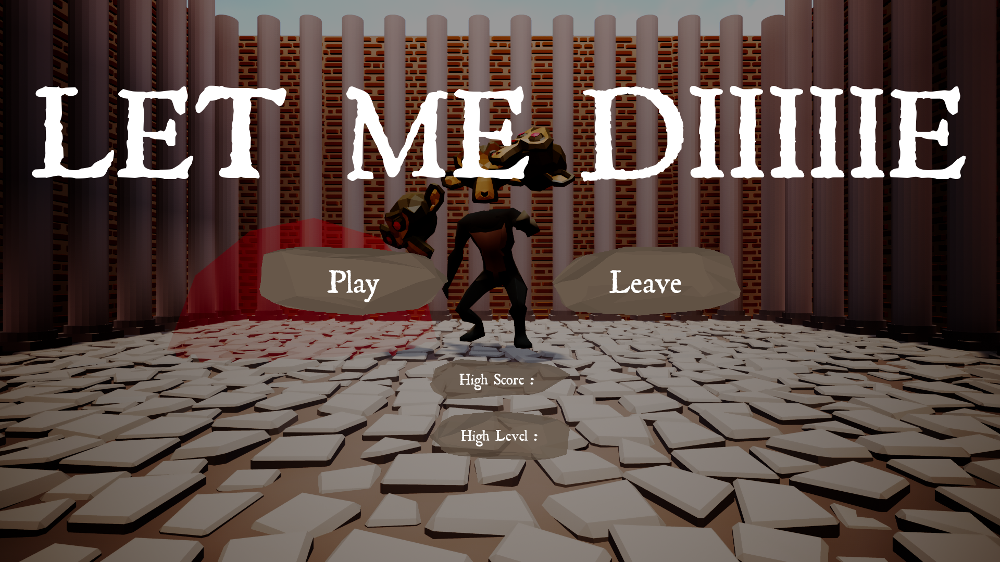
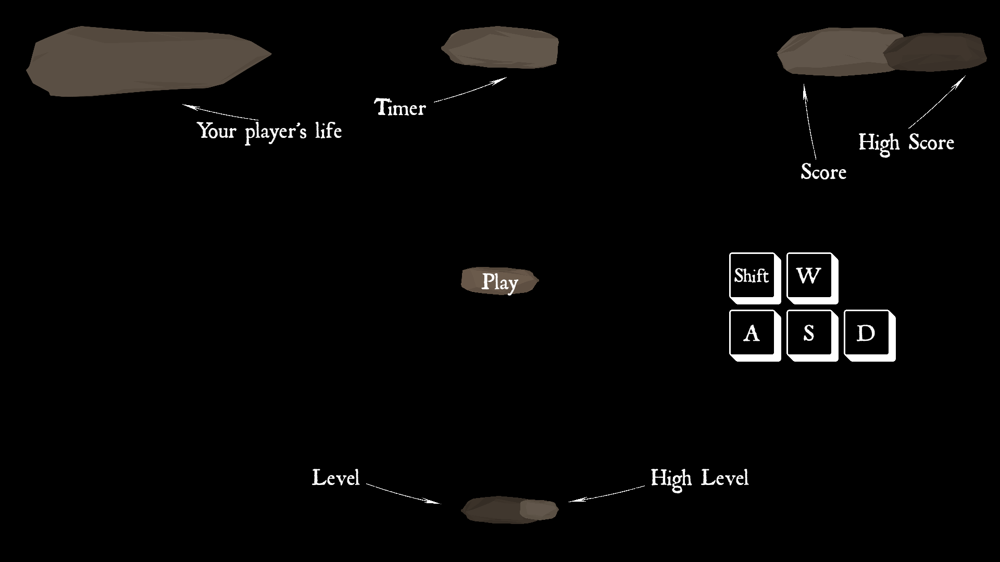
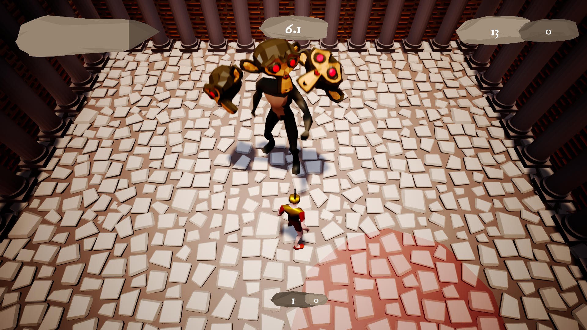
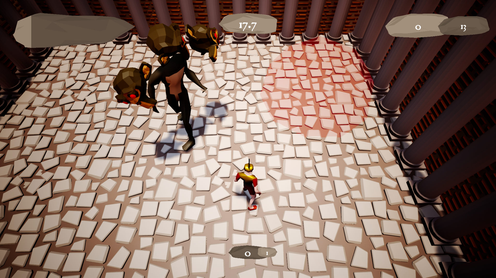
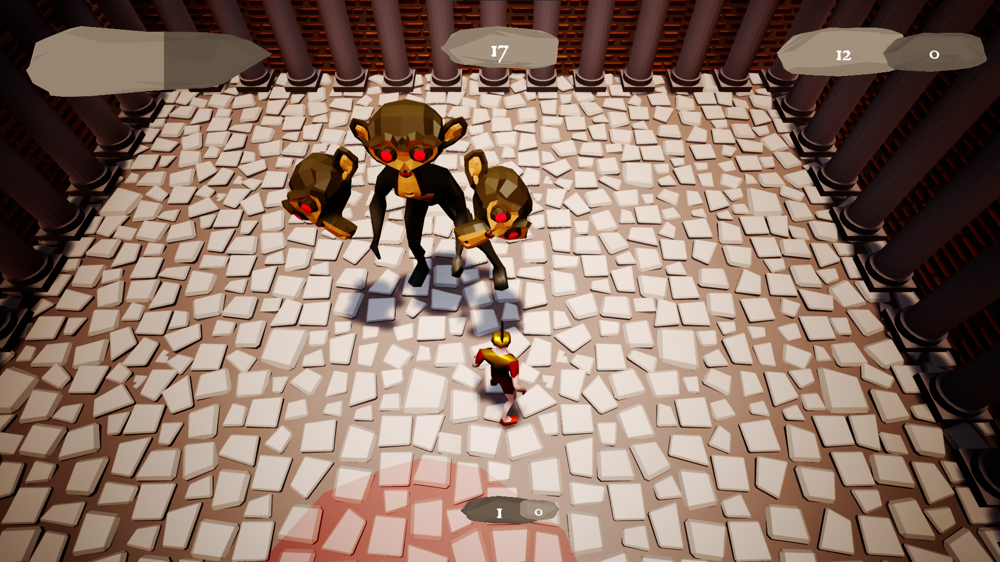
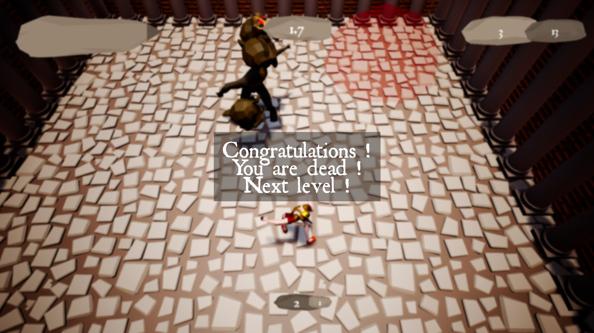

# Let Me Diiiiie

In LetMeDiiiiie, you are between the death and the live, but you don't want to rebirthing. The only way to be dead is to be killed by Cerber, the tree monkeys heads monster. If you don't succeed, you are coming back to live, and you lose.

## Contributors

[@untypequicode](https://github.com/untypequicode) : programing, UI, animations, music

[@bug](#) : 3d modeling, level design, music

## Music

O Fortunae - Carmina Bunara, played on cello by us

## Pictures

  
   

  
   
  

  
   

