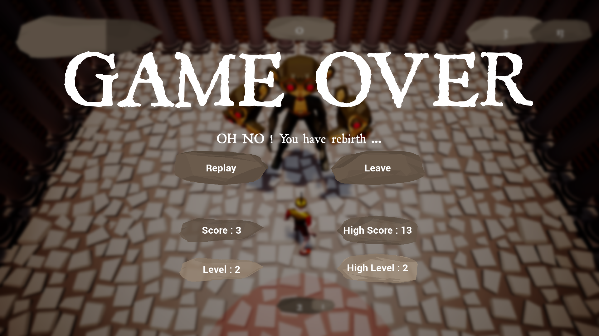

# Let Me Diiiiie

One single goal, to die. In LetMeDiiiiie, between life and death, the only way to win is to be killed by Cerber, the three-headed monkey monster. There won't be any respite, Cerber is very clever, so it's up to you to play!

## Contributors

[@untypequicode](https://github.com/untypequicode) : programing, UI, animations, music

[@bug](https://www.linkedin.com/in/elio-puyou/) : 3d modeling, level design, music

## Music

O Fortunae - Carmina Bunara, played on cello by us

## Pictures

  
   

  
   
  

  
   

